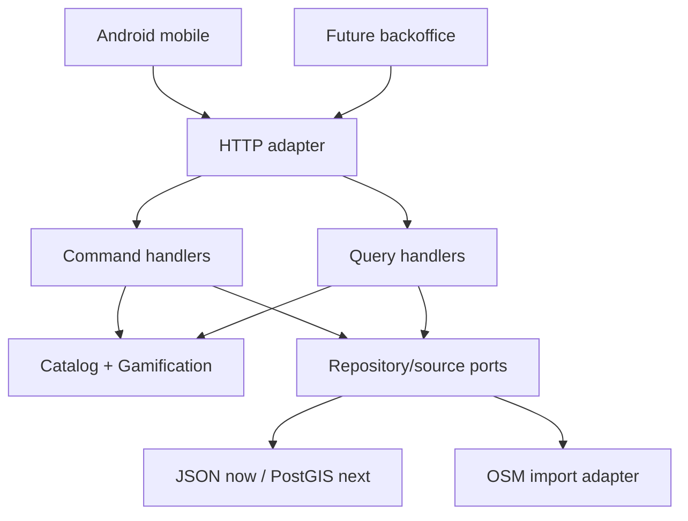

# ADR-0001: Fundación de plataforma Wayfii

- Estado: aceptada
- Fecha: 2026-07-28
- Rama: `feat/platform-hexagonal-foundation`

## Contexto observado

El `origin/main` auditado contiene una aplicación Android funcional con:

- motor de itinerarios local;
- Nominatim para geocodificación;
- Overpass para POI;
- OSMDroid para mapas;
- Wikimedia/Coil para imágenes;
- fallback mock;
- ViewModels y primeras iteraciones de interfaz.

El móvil resuelve todo el procesamiento y consulta proveedores públicos por
dispositivo. Ese diseño fue útil para validar la idea, pero dificulta:

- almacenar y curar lugares y espectáculos;
- corregir un dato una sola vez para todos los usuarios;
- controlar cuotas, cachés, atribución y calidad;
- incorporar gamificación verificable;
- construir un modelo comercial sin contaminar el ranking;
- evolucionar el algoritmo sin publicar una nueva APK.

## Decisión

### 1. Monorepo con soluciones independientes

```text
apps/mobile  -> Android/Kotlin/Compose
apps/api     -> Go
```

Cada solución tiene su propio toolchain y puede desplegarse por separado.

### 2. API en Go

Se elige Go por:

- baja huella de memoria y arranque rápido;
- concurrencia simple para importadores, enriquecimiento y consultas;
- binario estático y despliegue pequeño;
- biblioteca HTTP estándar suficiente para el MVP;
- buen encaje para un servicio intensivo en red y consultas geográficas.

Java sería técnicamente válido, especialmente con Quarkus o Micronaut, pero
agregaría framework, build y una huella operativa mayor en esta etapa. Kotlin
backend compartiría lenguaje con Android, no dominio ejecutable: el modelo
móvil y el servidor tienen ciclos de vida y responsabilidades diferentes.

Se fija Go 1.26, línea estable disponible al tomar esta decisión.

### 3. Arquitectura hexagonal con CQRS selectivo

No son alternativas excluyentes:

- **Hexagonal** aísla dominio y casos de uso de HTTP, OSM y almacenamiento.
- **CQRS selectivo** usa puertos y handlers diferentes para comandos y
  consultas.

El MVP sigue siendo un monolito modular. No se incorporan microservicios,
Kafka, Kubernetes ni event sourcing antes de necesitar su costo.



### 4. Contextos iniciales

| Contexto | Responsabilidad |
|---|---|
| Catálogo | Lugares, eventos, procedencia, calidad y publicación |
| Itinerarios | Ranking, secuencia, tiempos, costo conocido y explicación |
| Gamificación | Ledger idempotente, puntos, nivel, racha y badges |
| Alianzas | Ofertas explícitas y separadas del ranking orgánico |

### 5. Persistencia evolutiva

- Desarrollo: snapshot JSON con escritura atómica.
- Producción: PostgreSQL + PostGIS.
- Escala posterior: réplica/índice de lectura detrás del puerto de consultas.

La migración inicial incluye índices GiST para búsquedas geográficas, GIN para
categorías/tags y outbox transaccional para proyecciones futuras.

### 6. Transición del móvil

El motor local se conserva temporalmente como fallback. La secuencia segura es:

1. estabilizar `POST /v1/itineraries/plan`;
2. crear `RemoteItineraryRepository` en Android;
3. usar API como fuente primaria y motor local como fallback;
4. medir paridad, latencia y errores;
5. retirar llamadas directas a Overpass/Nominatim del móvil cuando exista
   cobertura operativa suficiente.

## Consecuencias

### Positivas

- un único catálogo corregible y auditable;
- menor cantidad de llamadas externas;
- reglas y gamificación controladas por servidor;
- libertad para cambiar OSM, PostGIS o un proveedor de eventos;
- despliegue económico en una VM o contenedor pequeño.

### Costos

- aparece operación de backend;
- hay que diseñar sincronización/offline;
- autenticación, moderación y antifraude todavía deben implementarse;
- el adaptador PostGIS requiere una segunda iteración.

## Reglas de evolución

- No crear un microservicio por contexto mientras un monolito modular alcance.
- No mezclar acuerdos pagos con el score orgánico del itinerario.
- Todo dato importado debe conservar proveedor, ID externo, licencia y
  atribución.
- Toda actividad gamificada debe usar clave de idempotencia.
- Los endpoints administrativos deben autenticarse y auditarse en producción.
