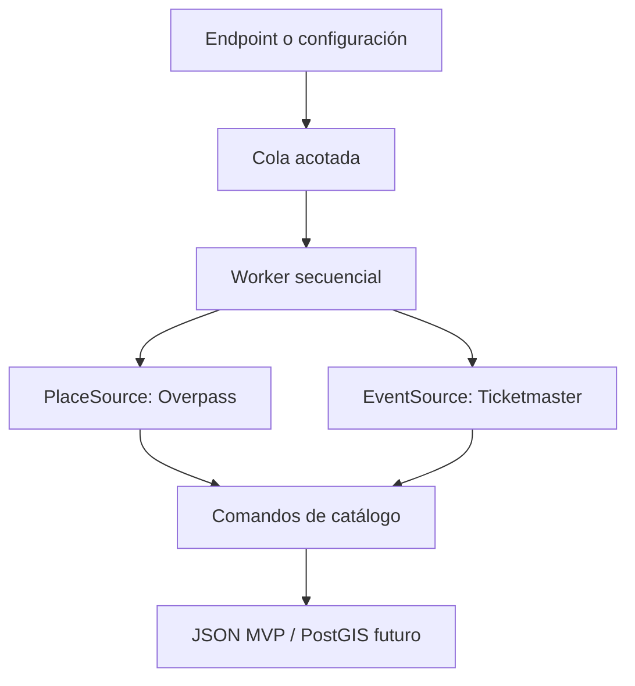

# Investigación de fuentes reales para el catálogo

Fecha de evaluación: 2026-07-28.

## Objetivo

Definir fuentes externas que Wayfii pueda ingerir y normalizar en su catálogo
propio sin depender de datos simulados, sin convertir una API costosa en el
centro del producto y sin abusar de infraestructura comunitaria.

La evaluación considera:

- cobertura geográfica y temática;
- posibilidad de persistir y reutilizar los datos;
- licencia, atribución y restricciones comerciales;
- autenticación y costo de entrada;
- límites operativos;
- calidad suficiente para puntos turísticos o eventos;
- facilidad de sustitución mediante puertos hexagonales.

## Matriz de decisión

| Fuente | Aporte | Cobertura | Condiciones relevantes | Decisión |
|---|---|---|---|---|
| OpenStreetMap mediante Overpass | POI, gastronomía, naturaleza, cultura, comercios y metadatos | Global | ODbL y atribución. La instancia pública principal considera razonable menos de 10.000 consultas y 1 GB por día, con identificación de la aplicación. No es un SLA. | **Seleccionada** como fuente canónica inicial de POI. |
| Nominatim público | Geocodificación de destinos | Global | Máximo absoluto de 1 solicitud/s, caché obligatoria y `User-Agent` identificable. La geocodificación masiva o periódica está restringida. | **Seleccionada con límites**: solo para solicitudes bajo demanda sin coordenadas. Los targets programados deben declarar coordenadas. |
| Ticketmaster Discovery API | Espectáculos, deportes, música, teatro y enlaces de venta | Global; Argentina figura entre los países soportados | Requiere API key. Cuota inicial de 5.000 llamadas/día y 5 solicitudes/s. Sus términos permiten almacenamiento solo por períodos razonables, pueden exigir eliminación en 24 h y restringen usos comerciales sin acuerdo. | **Seleccionada como conector opcional** para validar eventos. No será dependencia estratégica ni se activa sin credencial. |
| OpenTripMap | POI enriquecidos con descripciones, imágenes y rating | Global, más de 10 millones de objetos declarados | API key. Base ODbL; declara permitir precarga, modificación, indexación y caché. Agrega OSM, Wikidata y Wikipedia. | **Diferida**: aporta enriquecimiento, pero hoy duplicaría muchos POI de OSM sin reconciliación entre entidades. |
| Wikimedia APIs | Descripciones e imágenes | Global y multilingüe | Acceso abierto, `User-Agent` identificable, baja concurrencia y atribución/licencia por contenido. | **Diferida** como enriquecedor después de incorporar reconciliación por `wikidata`/`wikipedia`. |
| Buenos Aires Data: API de lugares de interés | POI oficiales de CABA y AMBA | Regional | El portal informa que los recursos con formato API están suspendidos y en revisión desde junio de 2026. | **Descartada por ahora** como dependencia de runtime. Los CSV/JSON estables podrán incorporarse mediante adaptadores batch. |

## Arquitectura elegida

La primera versión del worker usa dos puertos independientes:

- `PlaceSource`, implementado por Overpass;
- `EventSource`, implementado opcionalmente por Ticketmaster.

El worker no conoce HTTP, JSON de proveedores ni API keys. Recibe entidades de
dominio normalizadas y las guarda mediante los comandos del catálogo.

## Reglas operativas

1. Una sola ejecución consume proveedores a la vez; no se paralelizan
   consultas contra servicios públicos.
2. La cola es acotada y rechaza sobrecarga.
3. Cada job conserva estado, timestamps y resultado por fuente.
4. Las ejecuciones manuales requieren credencial administrativa.
5. Los targets programados deben incluir coordenadas para no convertir
   Nominatim en un geocoder batch.
6. Los proveedores se seleccionan explícitamente. Solicitar uno no configurado
   falla antes de encolar.
7. Los IDs externos son deterministas, de modo que una reingesta actualiza el
   mismo lugar o evento.
8. Un fallo parcial no elimina datos válidos importados desde otra fuente.
9. Overpass reintenta de forma acotada respuestas `429`, `502`, `503` y `504`;
   cada importación persiste como máximo 500 POI.
10. Las fuentes propietarias permanecen detrás de feature flags y sus datos
   deben tener una política de frescura/eliminación antes de producción.

## Activación

### Bajo demanda

`POST /v1/workers/catalog/jobs` crea un job asíncrono y responde `202`. El
cliente consulta su estado mediante `GET /v1/workers/catalog/jobs/{jobId}`.

### Por configuración

`CATALOG_SYNC_TARGETS_JSON` define destinos, coordenadas, radio y fuentes.
`CATALOG_SYNC_RUN_ON_START` permite una carga al iniciar.
`CATALOG_SYNC_INTERVAL` habilita repetición con una duración Go, por ejemplo
`24h`.

## Riesgos y siguientes fuentes

- Ticketmaster sirve para validar el valor de incluir espectáculos, pero un
  modelo comercial debe negociar derechos o reemplazarlo por acuerdos directos
  con municipios, venues y organizadores.
- Antes de combinar OpenTripMap/Wikimedia con OSM se necesita una etapa de
  reconciliación por IDs, proximidad y nombre normalizado.
- Para cobertura regional a escala conviene importar extractos OSM y feeds
  oficiales, en lugar de aumentar consultas a instancias comunitarias.
- El registro de jobs es inicialmente en memoria. El catálogo sí persiste; los
  estados de ejecución deberán pasar a PostgreSQL antes de ejecutar múltiples
  réplicas.

## Fuentes primarias

- [Overpass API y sus instancias públicas](https://wiki.openstreetmap.org/wiki/Overpass_API)
- [Política oficial de Nominatim](https://operations.osmfoundation.org/policies/nominatim/)
- [Ticketmaster Discovery API](https://developer.ticketmaster.com/products-and-docs/apis/discovery-api/v2/)
- [Términos generales de Ticketmaster Developer](https://developer.ticketmaster.com/support/terms-of-use/)
- [OpenTripMap API](https://dev.opentripmap.org/)
- [Wikimedia APIs](https://www.mediawiki.org/wiki/Wikimedia_APIs)
- [Límites de Wikimedia APIs](https://www.mediawiki.org/wiki/Wikimedia_APIs/Rate_limits)
- [Buenos Aires Data: API Búsqueda Lugares de Interés](https://data.buenosaires.gob.ar/dataset/api-busqueda-lugares-interes)
