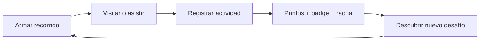

# Gamificación y modelo sustentable

## Objetivo de producto

La gamificación debe aumentar exploración, retorno y contribución útil. No debe
convertirse en una capa de puntos sin valor ni premiar el gasto por encima de
la experiencia.

## Loop inicial

## Actividades y puntos iniciales

| Actividad | Puntos | Motivo |
|---|---:|---|
| Visitar un lugar | 20 | Exploración central |
| Asistir a un evento | 30 | Actividad sensible a fecha |
| Completar itinerario | 40 | Resultado principal |
| Proponer un lugar | 25 | Mejora del catálogo |
| Validar información | 15 | Calidad comunitaria |
| Canjear un beneficio | 5 | Engagement, deliberadamente bajo |

Los valores son política configurable y requieren experimentación. Las
redenciones puntúan poco para evitar un sistema “pay-to-win”.

## Controles necesarios antes de producción

- idempotencia por actividad;
- sesión autenticada;
- ventana temporal y distancia razonable;
- señales de dispositivo con consentimiento;
- límites por usuario/día;
- revisión de contribuciones;
- detección de patrones anómalos;
- mecanismo de apelación;
- minimización y retención limitada de ubicación.

No se debe exigir tracking continuo. Una prueba de presencia puntual y
proporcional es preferible.

## Modelo de negocio recomendado

### Gratis para viajeros

- creación de itinerarios;
- catálogo y eventos;
- progreso básico;
- mapas y guardado limitado.

### Ingresos compatibles con confianza

1. **Suscripción B2B para aliados**
   - ficha verificada;
   - gestión de horarios/eventos;
   - métricas agregadas;
   - publicación de beneficios.

2. **Comisión por conversión**
   - entradas, experiencias o reservas;
   - solo cuando exista trazabilidad explícita.

3. **Wayfii Premium**
   - itinerarios offline;
   - viajes colaborativos;
   - mayor historial y personalización;
   - sin publicidad.

4. **Destino/municipio**
   - panel de contenidos;
   - circuitos oficiales;
   - analítica agregada y no identificable;
   - campañas estacionales.

## Reglas de integridad comercial

- Un pago no modifica silenciosamente el ranking orgánico.
- Una oferta patrocinada siempre lleva disclosure visible.
- El usuario puede distinguir recomendación, beneficio y anuncio.
- La analítica comercial es agregada; no se vende ubicación individual.
- Los puntos no tienen valor monetario ni promesa financiera.

## Métricas para validar sustentabilidad

| Dimensión | Métrica |
|---|---|
| Activación | itinerario generado / alta |
| Utilidad | porcentaje de paradas iniciadas/completadas |
| Retención | D7 y D30 de viajeros que generaron itinerario |
| Catálogo | frescura, cobertura y tasa de corrección |
| Gamificación | usuarios con segunda actividad, no puntos emitidos |
| Aliados | conversión, renovación y costo de soporte |
| Infraestructura | costo por itinerario y por usuario activo |

La primera señal de negocio no es vender publicidad: es demostrar que Wayfii
produce recorridos usados y que puede atribuir valor a un aliado sin romper la
confianza.
